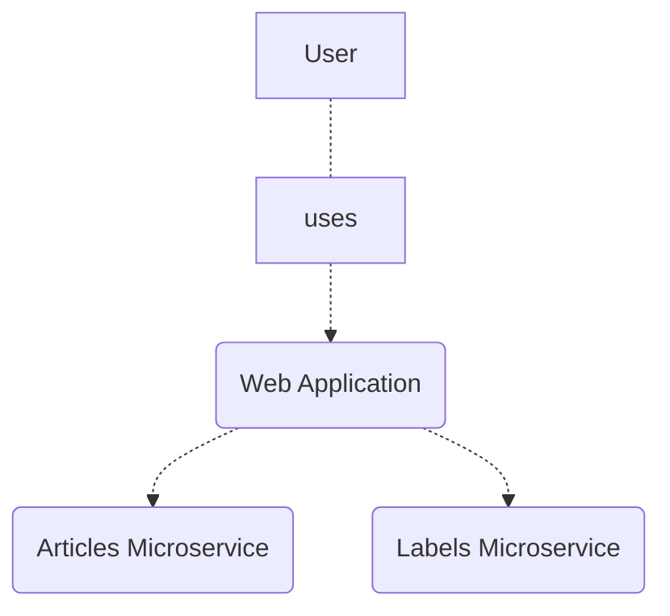
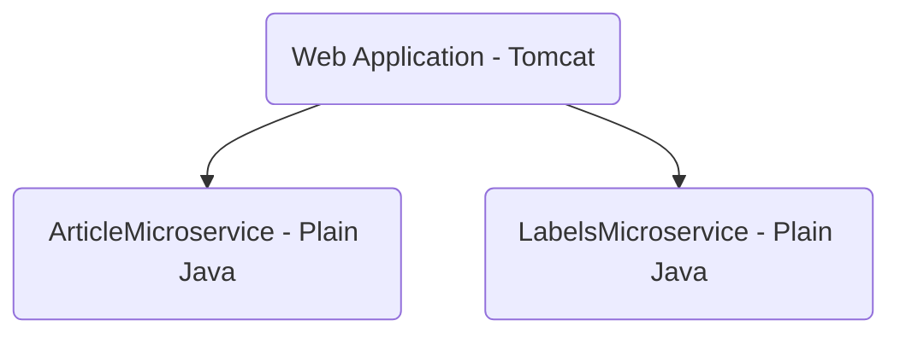
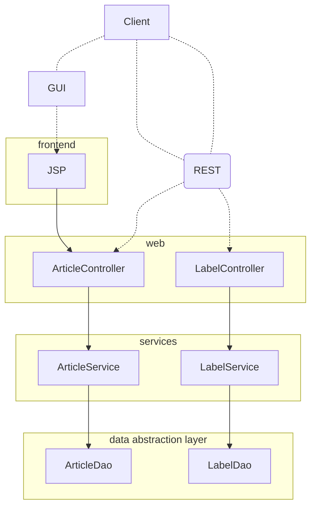
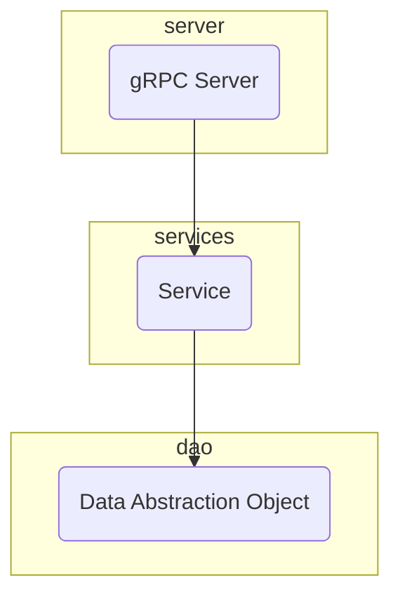
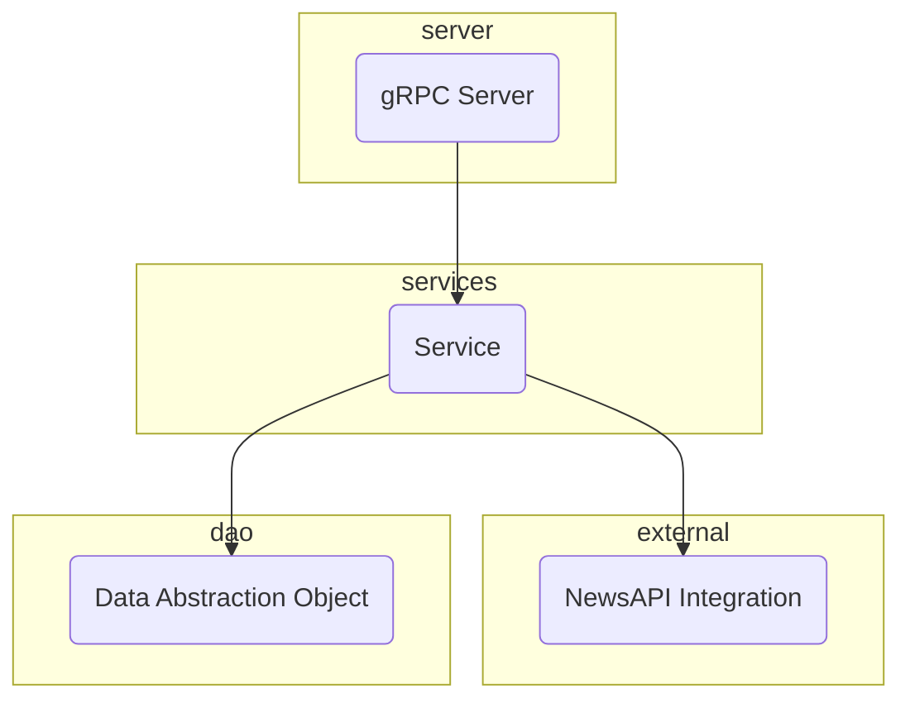
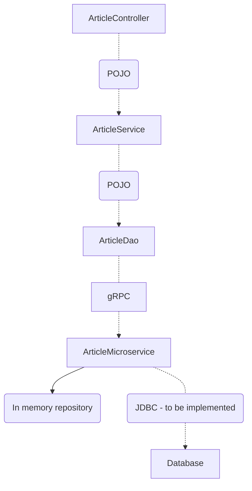
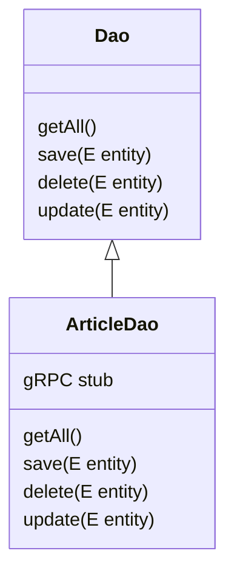

# System diagram

# Docker diagram (of WebApplication)

# Component diagram of the Web Application

# Component diagram of Labels Microservice

# Component diagram of Article Microservice

# Flow for 'Article' entity

# Code

