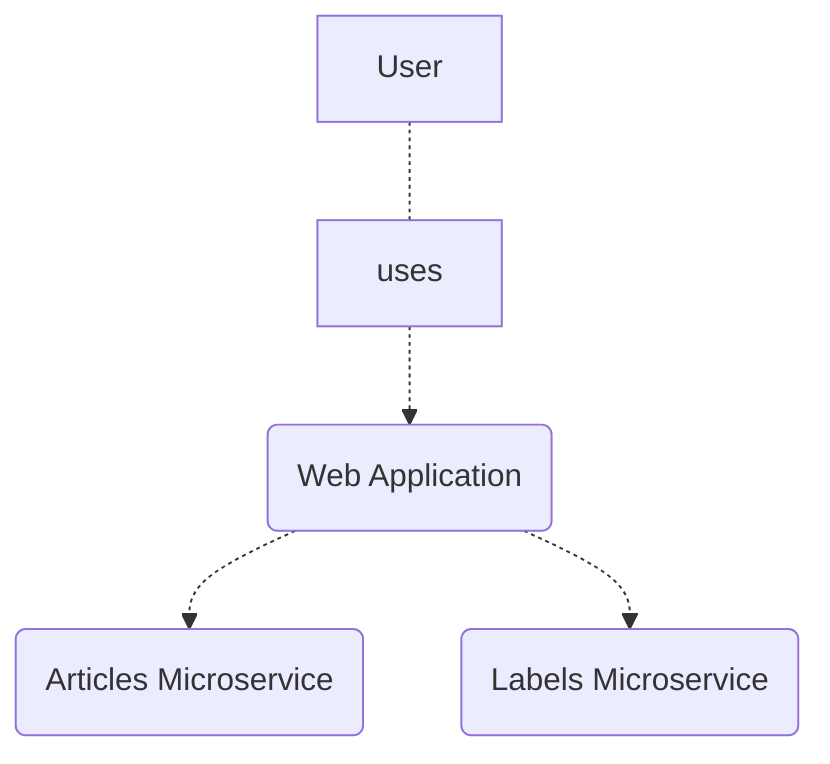
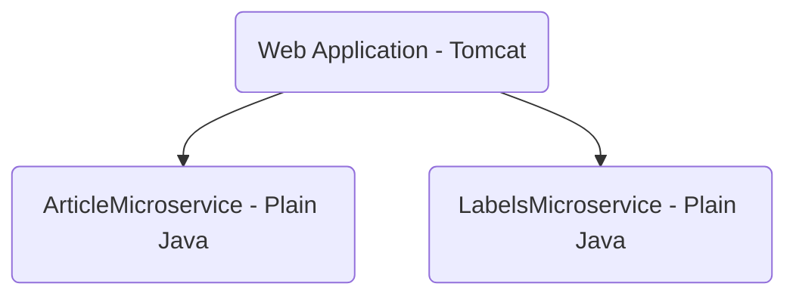
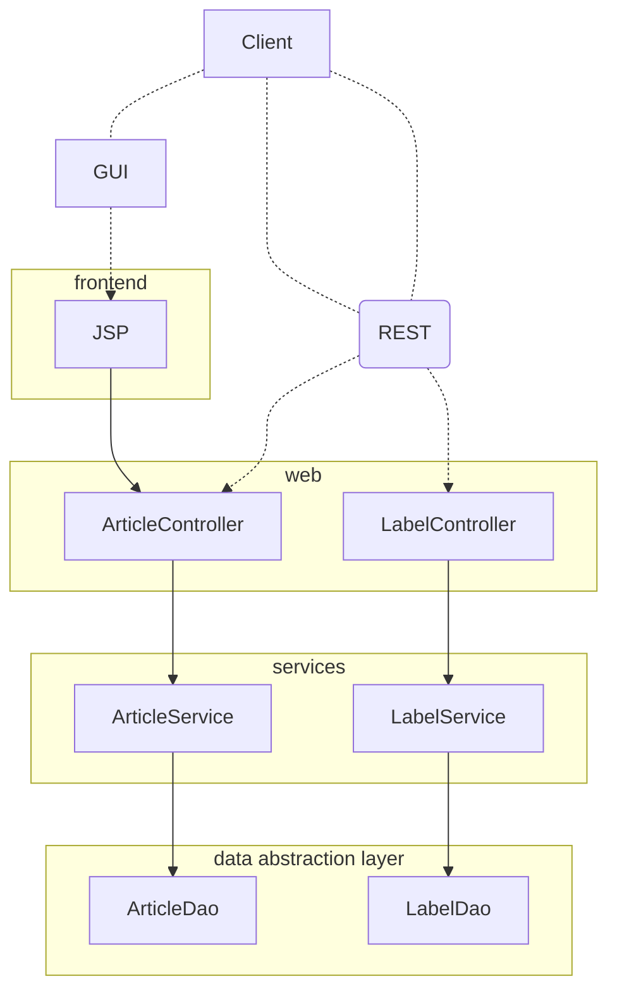
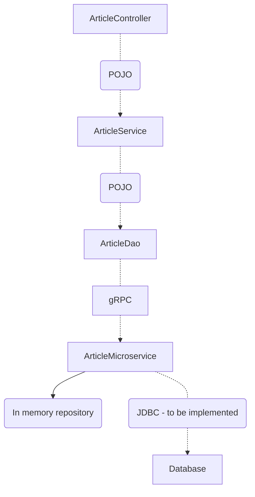
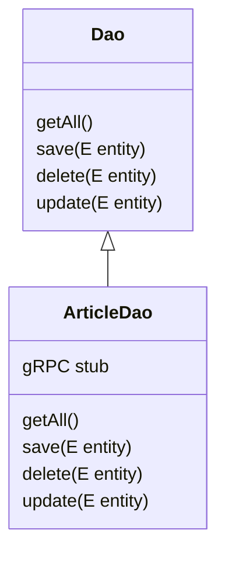

# System diagram



# Docker diagram (of WebApplication)



# Component diagram of the Web Application



# Flow for 'Article' entity



# Code



```mermaid
sequenceDiagram
    A-->>B: message
    loop Every minute
        B-->>A: response
    end
 ```
